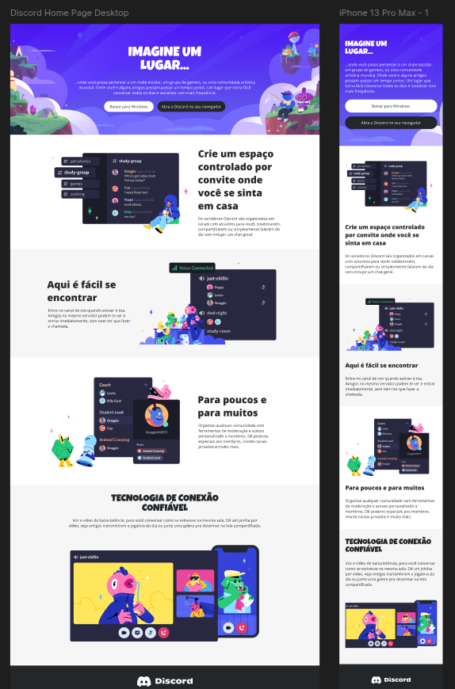

# Desafio 03: Criando um clone do Discord com HTML e CSS

## Bem vindo(a) ao terceiro desafio da Trilha de CSS da DIO-Santander! 

Nela, você vai construir um clone da página do Discord com HTML e CSS, colocando em prática os fundamentos do CSS, as propriedades básicas da linguagem de estilização, trabalhar principalmente com o conceito de responsividade.

[Link do Figma](https://www.figma.com/file/NRBYrG5d4DSzObv7dpTqoM/Desafio-Responsividade---DIO) contendo o protótipo do desafio para
que você possa se basear.

Para você realizar o desafio, **criar o arquivo e estilizar** usando como exemplo o modelo do figma.

*Seja criativo(a) e dê a sua identidade para o Projeto. Lembre-se que para um(a) Profissional de Tecnologia é super importante ter um portfólio sólido e completo.*